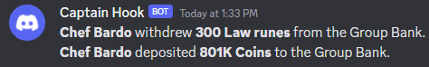

# Discord Group Bank Notifications
This is a plugin for RuneLite which sends a message to your discord channel when you or one of your Group Iron Man members deposits or withdraws items from the Group Bank.

In order to use this plugin you will need to create a discordWebhook on your discord server. Below are instructions for how to do so:
1. Open your Server Settings and head into the Integrations tab
2. Click the "Create Webhook" button to create a new discordWebhook
3. Once created, copy the discordWebhook URL and insert into the "Webhook URL" box in the plugin's configuration in RuneLite.

## Contribution
Contains code snippets from:
https://github.com/christoabrown/group-ironmen-tracker
https://github.com/cepawiel/RuneLite-Discord-Notifications
https://github.com/BossHuso/discord-rare-drop-notificater